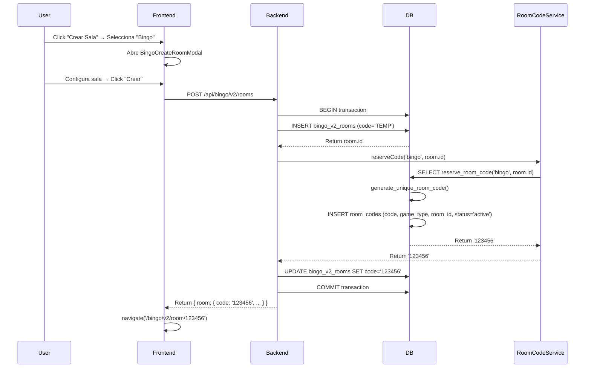
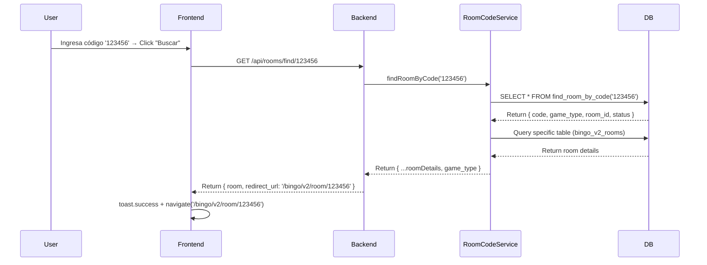

# Sistema Unificado de Códigos de Sala - MundoXYZ

**Fecha de Implementación:** 2025-11-05  
**Objetivo:** Garantizar códigos únicos cross-game y proporcionar búsqueda centralizada desde el lobby

---

## 📋 Descripción General

Sistema centralizado que garantiza que cada código de sala (6 dígitos numéricos) sea único a nivel global en toda la plataforma, independientemente del tipo de juego (TicTacToe, Bingo, Rifa).

### Problema Resuelto

**Antes:**
- Cada juego generaba códigos independientemente
- Verificación de duplicados solo dentro de su propia tabla
- Riesgo de colisión: código `123456` podía existir en TicTacToe y Bingo simultáneamente
- Usuario no podía buscar sala solo con el código

**Después:**
- Registro central `room_codes` con constraint `UNIQUE(code)`
- Códigos garantizados únicos en toda la plataforma
- Quick Join desde lobby encuentra sala automáticamente sin especificar tipo de juego

---

## 🏗️ Arquitectura

### 1. Tabla Central: `room_codes`

```sql
CREATE TABLE room_codes (
    id SERIAL PRIMARY KEY,
    code VARCHAR(6) NOT NULL UNIQUE,
    game_type VARCHAR(20) NOT NULL CHECK (game_type IN ('tictactoe', 'bingo', 'raffle')),
    room_id VARCHAR(255) NOT NULL,
    status VARCHAR(20) NOT NULL DEFAULT 'active' CHECK (status IN ('active', 'finished', 'cancelled')),
    created_at TIMESTAMP DEFAULT CURRENT_TIMESTAMP,
    updated_at TIMESTAMP DEFAULT CURRENT_TIMESTAMP,
    CONSTRAINT unique_room_reference UNIQUE (game_type, room_id)
);
```

**Campos:**
- `code`: Código único de 6 dígitos numéricos
- `game_type`: Tipo de juego ('tictactoe', 'bingo', 'raffle')
- `room_id`: ID de la sala en su tabla específica (tictactoe_rooms.id, bingo_v2_rooms.id, raffles.id)
- `status`: Estado actual de la sala ('active', 'finished', 'cancelled')

**Índices:**
- `idx_room_codes_code`: Búsqueda rápida por código
- `idx_room_codes_active`: Filtrado de salas activas

### 2. Funciones SQL

#### `generate_unique_room_code()`
Genera código de 6 dígitos garantizando unicidad.

```sql
CREATE OR REPLACE FUNCTION generate_unique_room_code() RETURNS VARCHAR(6)
```

- Genera códigos aleatorios de 6 dígitos
- Verifica existencia en `room_codes`
- Máximo 50 intentos antes de fallar

#### `reserve_room_code(p_game_type, p_room_id)`
Reserva código para una sala específica.

```sql
CREATE OR REPLACE FUNCTION reserve_room_code(
    p_game_type VARCHAR(20),
    p_room_id VARCHAR(255)
) RETURNS VARCHAR(6)
```

- Llama a `generate_unique_room_code()`
- INSERT en `room_codes` con estado 'active'
- Retorna el código generado

#### `update_room_code_status(p_code, p_status)`
Actualiza el estado de un código.

```sql
CREATE OR REPLACE FUNCTION update_room_code_status(
    p_code VARCHAR(6),
    p_status VARCHAR(20)
) RETURNS VOID
```

#### `find_room_by_code(p_code)`
Busca sala por código.

```sql
CREATE OR REPLACE FUNCTION find_room_by_code(p_code VARCHAR(6))
RETURNS TABLE(code VARCHAR(6), game_type VARCHAR(20), room_id VARCHAR(255), status VARCHAR(20))
```

---

## 🔧 Backend

### RoomCodeService (`backend/services/roomCodeService.js`)

Servicio centralizado para operaciones con códigos.

#### Métodos Principales:

**`reserveCode(gameType, roomId, client)`**
```javascript
const code = await RoomCodeService.reserveCode('tictactoe', roomId, client);
// Retorna: '123456'
```

**`findRoomByCode(code)`**
```javascript
const room = await RoomCodeService.findRoomByCode('123456');
// Retorna: { code: '123456', game_type: 'tictactoe', room_id: 'uuid...', status: 'active' }
```

**`getRoomDetails(code)`**
```javascript
const details = await RoomCodeService.getRoomDetails('123456');
// Retorna: { ...roomData, game_type: 'tictactoe' }
```

**`updateStatus(code, status, client)`**
```javascript
await RoomCodeService.updateStatus('123456', 'finished', client);
```

### Integración en Creación de Salas

#### TicTacToe (`backend/routes/tictactoe.js`)

```javascript
// 1. Crear sala con código temporal
const roomId = uuidv4();
const roomResult = await client.query(
  `INSERT INTO tictactoe_rooms (id, code, ...) VALUES ($1, 'TEMP', ...) RETURNING *`,
  [roomId, ...]
);

// 2. Generar código único
const code = await RoomCodeService.reserveCode('tictactoe', roomId, client);

// 3. Actualizar sala con código real
await client.query('UPDATE tictactoe_rooms SET code = $1 WHERE id = $2', [code, roomId]);

room.code = code;
```

#### Bingo (`backend/services/bingoV2Service.js`)

```javascript
// 1. Crear sala con código temporal
const result = await dbQuery(
  `INSERT INTO bingo_v2_rooms (code, ...) VALUES ('TEMP', ...) RETURNING *`,
  [...]
);

// 2. Generar código único
const roomCode = await RoomCodeService.reserveCode('bingo', result.rows[0].id, client);

// 3. Actualizar sala
await dbQuery('UPDATE bingo_v2_rooms SET code = $1 WHERE id = $2', [roomCode, result.rows[0].id]);
```

#### Rifas (`backend/services/RaffleService.js`)

```javascript
// 1. Insertar rifa con código temporal
const raffleResult = await client.query(
  `INSERT INTO raffles (code, ...) VALUES ('TEMP', ...) RETURNING *`,
  [...]
);

// 2. Generar código único
const raffleCode = await RoomCodeService.reserveCode('raffle', raffleResult.rows[0].id, client);

// 3. Actualizar rifa
await client.query('UPDATE raffles SET code = $1 WHERE id = $2', [raffleCode, raffleResult.rows[0].id]);
```

### Endpoint Quick Join (`backend/routes/rooms.js`)

#### `GET /api/rooms/find/:code`

**Request:**
```
GET /api/rooms/find/123456
```

**Response Exitoso:**
```json
{
  "success": true,
  "room": {
    "code": "123456",
    "game_type": "tictactoe",
    "status": "waiting",
    "host_username": "user123",
    ...
  },
  "redirect_url": "/tictactoe/room/123456"
}
```

**Response Error:**
```json
{
  "success": false,
  "error": "Sala no encontrada",
  "code": "ROOM_NOT_FOUND"
}
```

**Códigos de Error:**
- `ROOM_NOT_FOUND`: Código no existe
- `ROOM_FINISHED`: Sala ya terminó
- `ROOM_CANCELLED`: Sala fue cancelada

#### `GET /api/rooms/active`

Obtiene salas activas del usuario autenticado.

**Response:**
```json
{
  "success": true,
  "rooms": [
    {
      "code": "123456",
      "game_type": "tictactoe",
      "mode": "fires",
      "bet_amount": 10,
      "status": "waiting",
      "host_username": "user123",
      "player_role": "X"
    },
    {
      "code": "654321",
      "game_type": "bingo",
      "name": "Sala de user456",
      "card_cost": 5,
      "currency_type": "coins",
      "status": "in_progress",
      "host_username": "user456",
      "cards_purchased": 3
    }
  ]
}
```

---

## 🎨 Frontend

### Lobby Unificado (`frontend/src/pages/Lobby.js`)

#### Componentes Principales:

**1. Botón Crear Sala**
- Abre modal selector con opciones: TicTacToe, Bingo, Rifa
- Al seleccionar, abre el modal de creación correspondiente
- Después de crear, redirige a la sala

**2. Quick Join**
```jsx
<input
  type="text"
  placeholder="000000"
  value={quickJoinCode}
  onChange={(e) => setQuickJoinCode(e.target.value.replace(/\D/g, '').slice(0, 6))}
  className="input-glass flex-1 text-center text-xl tracking-wider font-mono"
  maxLength={6}
  onKeyPress={(e) => e.key === 'Enter' && handleQuickJoin()}
/>
```

**Lógica:**
```javascript
const handleQuickJoin = async () => {
  if (!quickJoinCode || quickJoinCode.length !== 6) {
    toast.error('Ingresa un código válido de 6 dígitos');
    return;
  }

  const res = await fetch(`/api/rooms/find/${quickJoinCode}`);
  const data = await res.json();

  if (!res.ok) {
    // Manejo de errores con mensajes específicos
    return;
  }

  toast.success('¡Sala encontrada! Redirigiendo...');
  navigate(data.redirect_url);
};
```

**3. Mis Salas Activas**
- Query con React Query que refresca cada 10s
- Muestra: icono del juego, código, host, estado
- Click en sala → navega directamente

```javascript
const { data: myRooms } = useQuery({
  queryKey: ['my-active-rooms'],
  queryFn: async () => {
    const res = await fetch('/api/rooms/active', {
      headers: {
        'Authorization': `Bearer ${localStorage.getItem('token')}`
      }
    });
    const data = await res.json();
    return data.rooms || [];
  },
  enabled: !!user,
  refetchInterval: 10000
});
```

---

## 📊 Flujo Completo

### Flujo de Creación



### Flujo de Quick Join



---

## 🔍 Logging y Debugging

### Logs del Sistema

**Creación de Código:**
```
🔐 Reservando código de sala { gameType: 'tictactoe', roomId: 'uuid...' }
✅ Código reservado exitosamente { code: '123456', gameType: 'tictactoe', roomId: 'uuid...' }
```

**Quick Join:**
```
🔍 Quick Join - Buscando sala { code: '123456' }
✅ Sala encontrada - Quick Join exitoso { code: '123456', gameType: 'tictactoe', redirectUrl: '/tictactoe/room/123456' }
```

**Errores:**
```
❌ Error al reservar código de sala { error: '...', gameType: 'bingo', roomId: 'uuid...' }
⚠️ Sala no encontrada { code: '999999' }
```

---

## 🧪 Testing

### Testing Manual

**1. Creación de Salas:**
- ✅ Crear TicTacToe → verificar código único
- ✅ Crear Bingo → verificar código único
- ✅ Crear Rifa → verificar código único
- ✅ Crear 3 salas → verificar los 3 códigos son diferentes

**2. Quick Join:**
- ✅ Código válido (TicTacToe) → redirige correctamente
- ✅ Código válido (Bingo) → redirige correctamente
- ✅ Código válido (Rifa) → redirige correctamente
- ✅ Código inválido → muestra error apropiado
- ✅ Código de sala terminada → muestra error apropiado

**3. Mis Salas Activas:**
- ✅ Usuario con salas → muestra listado correcto
- ✅ Usuario sin salas → muestra mensaje vacío
- ✅ Click en sala → navega correctamente
- ✅ Refetch cada 10s → actualiza automáticamente

### Casos de Borde

**Colisión de Códigos:**
```sql
-- Intentar insertar código duplicado (debe fallar)
INSERT INTO room_codes (code, game_type, room_id) 
VALUES ('123456', 'bingo', 'some-id');
-- ERROR: duplicate key value violates unique constraint "room_codes_code_key"
```

**Código Temporal:**
- Si transacción falla después de INSERT con 'TEMP', rollback automático
- No quedan registros huérfanos con código 'TEMP'

---

## 📈 Performance

**Índices Críticos:**
- `idx_room_codes_code`: Búsqueda O(log n)
- `idx_room_codes_active`: Filtrado eficiente de salas activas

**Consultas Optimizadas:**
```sql
-- Quick Join (usa índice)
SELECT * FROM room_codes WHERE code = '123456';

-- Salas activas del usuario
-- Queries separadas por tabla + UNION (más eficiente que JOIN cross-tabla)
```

**Refetch Inteligente:**
- Lobby refresca salas activas cada 10s
- Solo si usuario autenticado
- React Query maneja caché automáticamente

---

## 🚀 Migración

### Archivo: `029_create_room_codes_registry.sql`

**Ejecuta automáticamente en deploy:**
1. Crea tabla `room_codes`
2. Crea funciones SQL
3. Crea índices
4. Crea triggers

**Retrocompatibilidad:**
- Salas existentes conservan su código
- Generador unificado solo para salas nuevas
- Sin impacto en producción

---

## 📝 Mantenimiento

### Limpieza de Códigos Viejos

```sql
-- Marcar salas terminadas (ejecutar periódicamente)
UPDATE room_codes
SET status = 'finished', updated_at = CURRENT_TIMESTAMP
WHERE room_id IN (
  SELECT id FROM tictactoe_rooms WHERE status = 'finished'
)
AND game_type = 'tictactoe'
AND status = 'active';
```

### Estadísticas

```sql
-- Ver distribución de códigos por juego
SELECT 
  game_type,
  status,
  COUNT(*) as count
FROM room_codes
GROUP BY game_type, status
ORDER BY game_type, status;
```

```javascript
// Endpoint de stats (admin)
GET /api/rooms/stats
```

---

## 🎯 Beneficios

### Para Usuarios:
- ✅ Quick Join simplificado (solo código, sin especificar juego)
- ✅ Vista unificada de todas sus salas activas
- ✅ Navegación directa desde lobby
- ✅ UX mejorada con feedback claro

### Para Desarrolladores:
- ✅ Código único garantizado (no más colisiones)
- ✅ Servicio centralizado reutilizable
- ✅ Logs exhaustivos para debugging
- ✅ Testing simplificado
- ✅ Mantenimiento reducido

### Para la Plataforma:
- ✅ Arquitectura limpia y escalable
- ✅ Consistencia de datos
- ✅ Fácil agregar nuevos tipos de juego
- ✅ Monitoreo centralizado

---

## 🔐 Seguridad

**Validaciones:**
- Códigos solo numéricos de 6 dígitos
- Verificación de existencia antes de navegar
- Verificación de estado de sala (no permite unirse a terminadas)
- Autenticación requerida para Quick Join y salas activas

**Rate Limiting:**
- Heredado del sistema global
- No hay endpoints específicos sin protección

---

## 📚 Referencias

**Archivos Clave:**
- Backend:
  - `backend/db/migrations/029_create_room_codes_registry.sql`
  - `backend/services/roomCodeService.js`
  - `backend/routes/rooms.js`
  - `backend/routes/tictactoe.js`
  - `backend/services/bingoV2Service.js`
  - `backend/services/RaffleService.js`
  
- Frontend:
  - `frontend/src/pages/Lobby.js`

**Documentos Relacionados:**
- `DATABASE_SCHEMA_MASTER.sql` - Schema completo de la DB
- `README.md` - Documentación general del proyecto

---

## ✅ Checklist de Implementación

- [x] Crear migración 029 con tabla y funciones SQL
- [x] Crear `roomCodeService.js` con métodos completos
- [x] Actualizar creación de salas TicTacToe
- [x] Actualizar creación de salas Bingo
- [x] Actualizar creación de rifas
- [x] Crear endpoint `/api/rooms/find/:code`
- [x] Crear endpoint `/api/rooms/active`
- [x] Registrar rutas en `server.js`
- [x] Implementar Lobby unificado con Quick Join
- [x] Implementar selector de tipo de sala
- [x] Implementar listado de salas activas
- [x] Crear documentación completa
- [ ] Testing manual completo
- [ ] Commit y push a GitHub
- [ ] Deploy a Railway
- [ ] Verificación en producción con Chrome DevTools

---

**Última Actualización:** 2025-11-05  
**Estado:** Implementación Completa - Pendiente Testing
